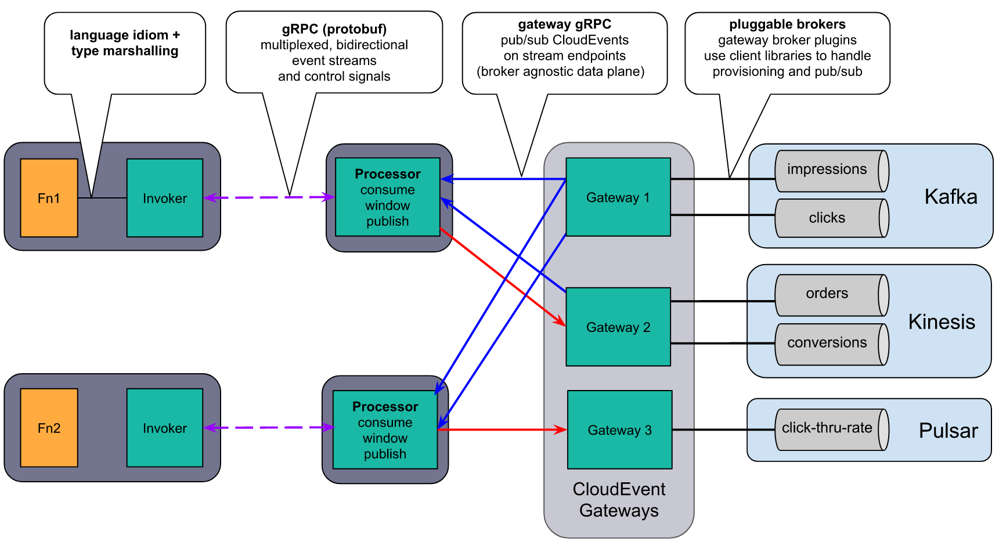

We are happy to announce riff v0.5.0. Thanks to all riff, Cloud Native Buildpack, Knative, Liiklus, KEDA, Contour, and other contributors.

The riff CLI can be downloaded from our [releases page](https://github.com/projectriff/cli/releases/tag/v0.5.0) on GitHub. The [getting started](/docs/v0.5/getting-started) guides will help you to run your first function.


## Streaming

This release introduces a new experimental streaming capability. Functions deployed using the [Streaming Runtime](/docs/v0.5/runtimes/streaming) are able to consume and produce streams of events. The Node and Java function invokers have been extended to support a new [streaming invoker specification](https://github.com/projectriff/invoker-specification/blob/master/streaming.md).

Here is an example of a JavaScript streaming function interface with 2 input and 1 output stream, using the [node function invoker]().
```js
module.exports = (inputStreams, outputStreams) => {
    const { impressions, orders } = inputStreams;
    const { conversions } = outputStreams;
    // do something
};
module.exports.$interactionModel = 'node-streams';
```
<!--truncate-->

#### Gateways and Processors

[Gateways](docs/v0.5/cli/riff-streaming-kafka-gateway) connect streams to a messaging service like Kafka. [Processors](/docs/v0.5/cli/riff-streaming-processor-create) connect functions with gateways.



This release includes Gateways for Kafka and Pulsar, and a non-production in-memory gateway. All three are based on [Liiklus](https://github.com/bsideup/liiklus).

#### Streaming Next Steps

We are discussing this streaming model with the community, and exploring ways to enable streaming for other types of workloads beyond streaming functions.

## Other Highlights of v0.5.0

### Knative Runtime

- The Knative runtime has been upgraded to use Knative Serving v0.12.1.
- [Contour](https://projectcontour.io) has replaced Istio as the ingress controller, and works with both the Knative and the Core runtime. Note that Deployers are only accessible from inside the cluster by default, `--ingress-policy External` is now [required](/docs/v0.5/cli/riff-knative-deployer-create) in order to route HTTP traffic from outside the cluster.
- The CLI also provides for configuration of
  -  `--min-scale` and `--max-scale`
  -  `--container-concurrency`

### Core Runtime

- We added Ingress support to the Core Runtime, allowing external HTTP requests to target functions, apps, and containers.

### Build

- Container images managed by `riff container create` are now resolved into image digests, and the controller polls the registry to detect image updates and propagate the changes to deployed workloads.
